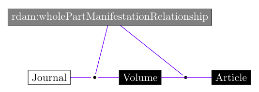

# notebook-identify-trends-corpora
Jupyter notebooks to work with text corpora to identify trends in text.

### Introduction to text analysis
This [notebook](introduction_to_text_analysis.ipynb) introduces how to analyse text to identify topic trends in text corpora.

### Biblioteca Virtual Miguel de Cervantes LOD & the journal Doxa
This [notebook](trends-doxa.ipynb) uses the Linked Open Data repository of the Biblioteca Virtual Miguel de Cervantes.

This example is based on the journal *Doxa. Cuadernos de Filosofía del Derecho* that is a periodical publication issued every year since 1984 to promote the interchange between philosophers of law from Latin America and Latin Europe. The information regarding this publication has been published as LOD in the BVMC repository, including metadata and text, and is accessible by means of the SPARQL endpoint.

